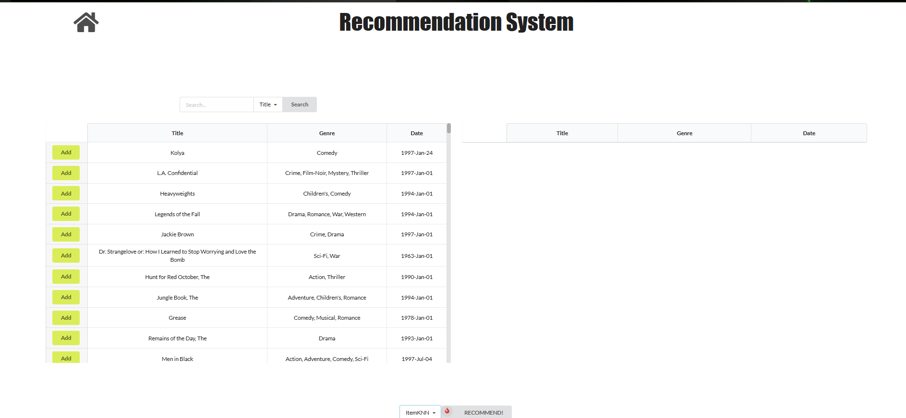

# Fullstack Movie Recommendation System
 </br>
<a></a>
<a>
<a></a>
<a></a>
<a></a>

This project is a full-stack movie recommendation system integrating **React**, **Flask**, **SQLite**, and a **Machine Learning Recommendation API** (PyTorch + Numpy).  
The system provides **Top-K movie recommendations** based on user inputs.

---

# ⚙️ Setup Instructions

## Requirements
Install all dependencies:

```bash
pip install -r requirements.txt
```

---

# 🖥️ Backend (Flask)

The backend:
- Loads the movie database  
- Communicates with the Recommendation API  
- Serves routes used by the React frontend  

We use the MovieLens ML-100k dataset to populate the DB.

### Initialize database (if needed)

```bash
flask db init
flask db migrate
flask db upgrade
```

### Load ML-100k dataset

```bash
cd backend
python initialize_ml100k_db.py
```

Run backend:

```bash
cd backend
flask run
```

Default URL: **http://127.0.0.1:5000**

---

# 🎨 Frontend (React)

Install packages:

```bash
cd react-front
npm install
```

Run frontend:

```bash
npm start
```

Default URL: **http://127.0.0.1:5052**

To edit your name/social links:  
`react-front/src/App.js`

---

# 🤖 Recommendation API (PyTorch)

This API:
- Trains recommendation models (EASE / ItemKNN)
- Saves model checkpoints
- Responds to movie recommendation requests

### Train a model:

```bash
cd api
python fit_offline.py --model MODEL_NAME --save_dir PATH_TO_SAVE_MODEL
```

Where:
- MODEL_NAME = `EASE` or `ItemKNN`
- PATH_TO_SAVE_MODEL = directory for saving model files

### Run API server:

```bash
cd api
python api.py
```

Default URL: **http://127.0.0.1:8000**

---

# ▶️ Running the Full System

Run **three terminals**:

### Terminal 1 — API
```bash
cd api
python api.py
```

### Terminal 2 — Backend
```bash
cd backend
flask run
```

### Terminal 3 — Frontend
```bash
cd react-front
npm start
```

System will be available at the frontend URL.

---

# 🔗 Running Frontend + Backend Together (Optional)

Install concurrently:

```bash
npm install -g concurrently
```

Add this script in `react-front/package.json`:

```json
"start-all": "concurrently \"react-scripts start\" \"cd ../backend && flask run\""
```

Then run:

```bash
npm run start-all
```

---

# 📌 TODO
- [ ] Display complete movie metadata
- [ ] Add advanced neural recommenders (LightGCN, SASRec, NeuMF)
- [ ] Improve UI (header, footer, animations)

---

# 📚 References
1. How To Create a React + Flask Project  
2. Image Recommendations with PyTorch + Flask  
3. ML App with Python + React + Docker  
4. tfrs-movierec-serving
